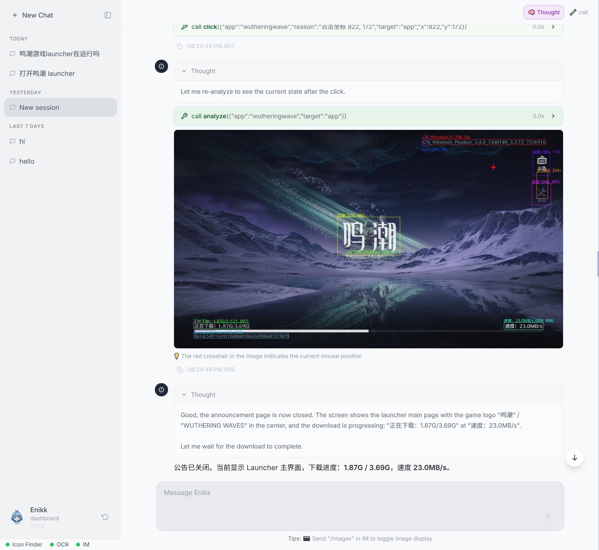
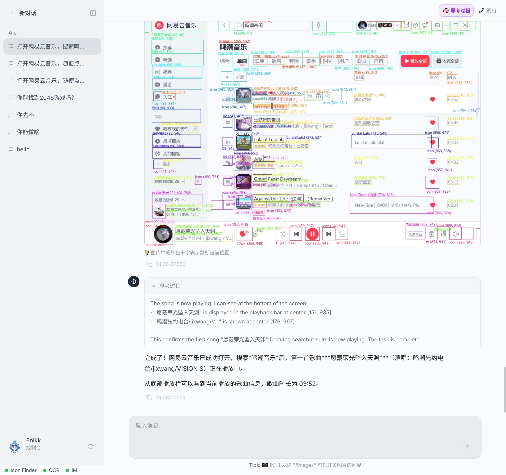
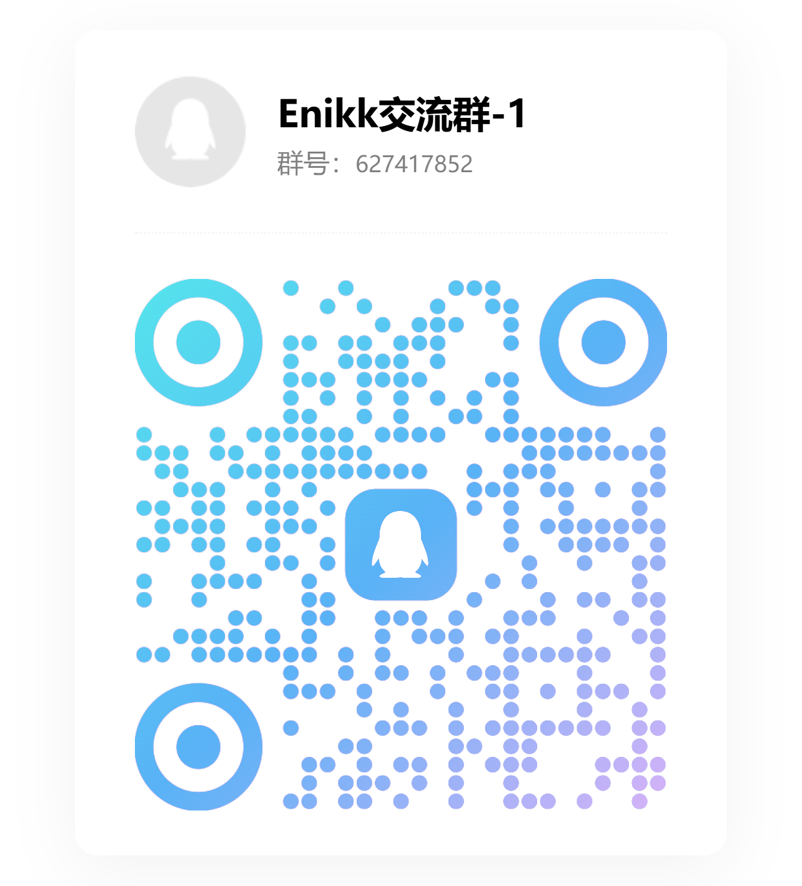

<p align="center">
  
</p>

# Enikk

**Open-source Computer Use Agent that works for Any App (GUI or CLI) by Any Model (Vision or Text).**

[](https://opensource.org/licenses/MIT)
[](https://www.python.org/downloads/)
[]()

Enikk is an AI agent that watches your screen, understands what it sees, and operates any desktop application — autonomously. It learns from experience, extracts reusable skills, and gets smarter every time you use it.

<p align="center">
  
</p>

---

## ✨ Key Features

### 🧠 Learns from Experience
After each task, Enikk automatically reviews what happened and extracts reusable skills into persistent memory. The agent gets smarter the more you use it.

### 💰 Smart & Cost-efficient
Enikk uses a multi-layer perception system (YOLO + OCR + VLM) that minimizes AI costs. Most operations never need expensive vision models — saving you money.

### ⚡ Zero Code Required
Configure everything through the Web Dashboard. No programming, no scripts, no YAML editing — just point-and-click setup.

### 🖥️ Multi-app Support
Control multiple applications simultaneously. Enikk auto-discovers windows and can switch between apps during a task.

### 📱 Remote Control via IM
Control Enikk from your phone through chat. Send a task via QQ, and Enikk executes it on your PC while you're away.

### 👁️ Fully Observable
Watch every step in the Web Dashboard: screenshots, detected elements, reasoning, and actions. No black boxes — complete transparency.

### 🔒 Local & Private
Runs entirely on your machine. Your data, screenshots, and credentials never leave your computer (except for AI API calls).

---

## 📸 Demo

<p align="center">


https://github.com/user-attachments/assets/32ca3e94-fdd5-4e8d-b3d2-19222fd437c6


  <em>Model Configuration - Point-and-click setup</em>
</p>

<p align="center">


https://github.com/user-attachments/assets/9ac22c98-672d-4652-9f17-258476152cc2


  <em>IM Configuration - Connect QQ Bot for remote control</em>
</p>

<p align="center">
  
  <br/>
  <em>Real-world Demo - Enikk controlling Netease Cloud Music</em>
  <br/>
  <a href="https://www.youtube.com/watch?v=oYyria7cMSk">▶ Watch demo on YouTube</a>
</p>

---

## 💬 Community

Join us for questions, feedback, and updates:

<p align="center">
  <a href="https://discord.gg/cck9qWukTg"></a>
  &nbsp;&nbsp;&nbsp;&nbsp;
  <a href="https://qm.qq.com/q/tJT45pTynK"></a>
</p>

<p align="center">
  <a href="https://discord.gg/cck9qWukTg"><b>Discord</b></a>&nbsp;&nbsp;&nbsp;&nbsp;&nbsp;&nbsp;&nbsp;&nbsp;&nbsp;&nbsp;&nbsp;&nbsp;&nbsp;&nbsp;&nbsp;&nbsp;&nbsp;&nbsp;&nbsp;&nbsp;&nbsp;&nbsp;&nbsp;&nbsp;&nbsp;&nbsp;&nbsp;&nbsp;&nbsp;&nbsp;&nbsp;<a href="https://qm.qq.com/q/tJT45pTynK"><b>QQ Group</b></a> (627417852)
</p>

- **Issues**: [Report bugs & request features](https://github.com/gtt116/enikk/issues)

---

## 🏗 Architecture

**Data flow:**
1. **Capture** — Take a screenshot of the target application window
2. **Parse** — YOLO detects UI elements, OCR reads text, results normalized to `[0,1000]` coordinates
3. **Decide** — LLM analyzes structured data and decides what to do
4. **Act** — Click, type, or wait based on the decision

---

## 🚀 Getting Started

### Download & Run

1. **Download** the latest release from [GitHub Releases](https://github.com/gtt116/enikk/releases)
2. **Unblock** — Right-click the zip → Properties → Check "Unblock" → OK
3. **Extract** the zip file (see `INSTALL.txt` in the extracted folder for details)
4. **Run** `enikk.exe`
5. **Open** — the dashboard opens automatically in a native window

That's it. No installation, no Python, no dependencies.

> [!IMPORTANT]
> Windows marks downloaded files as "from the internet" which may block execution. Always unblock the zip (step 2) before extracting. If SmartScreen still appears, click "More info" → "Run anyway".

---

## 🎮 Supported Applications

Enikk can control **any Windows desktop application**:

| App | Status |
|---|---|
| NIKKE | ✅ Built-in |
| Wuthering Waves | ✅ Built-in |
| Any Windows app | ✅ Custom |

---

## 🛠 For Developers

### Build from Source

```bash
# Install Git LFS first (for model weights)
git lfs install
git clone https://github.com/gtt116/enikk.git
cd enikk
uv venv --seed
uv pip install -e .
enikk
```

### Build Executable

```powershell
# Debug build (with console)
.\build.bat

# Release build (without console)
.\build.bat --release
```

Generated files:
- Debug mode: `dist/enikk-debug/enikk-debug.exe`
- Release mode: `dist/enikk/enikk.exe` and `dist/enikk.zip`

---

## 📦 Dependencies & Credits

Enikk stands on the shoulders of giants:

| Project | License | Role |
|---|---|---|
| [Hermes Agent](https://github.com/NousResearch/hermes-agent) (NousResearch) | MIT | AI Agent framework, tool system, memory, IM Platform |
| [OmniParser](https://github.com/microsoft/OmniParser) (Microsoft) | CC-BY-4.0 | YOLO model weights for UI element detection |
| [RapidOCR](https://github.com/RapidAI/RapidOCR) | Apache 2.0 | ONNX-based Chinese OCR engine |

Enikk's own code is **MIT License** — see [LICENSE](LICENSE).

---

## ⚠️ Disclaimer

This project is intended for **learning and research purposes only**. Do NOT use this project in violation of any laws, game terms of service, or for any illegal purposes. Users bear full responsibility for any consequences arising from the use of this project.

---

## 📄 License

MIT License — see [LICENSE](LICENSE) for details.
